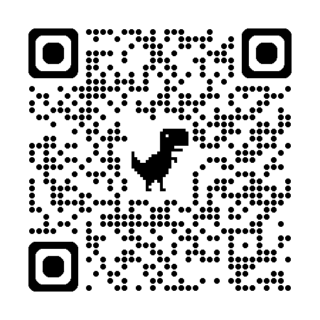

# WebAR Demon

> **Experiencia de Realidad Aumentada en Web (WebAR) que da vida a un demonio 3D mediante seguimiento de imágenes (Image Tracking).**


## ¡Pruébalo ahora mismo!

Escanea este código QR con la cámara del móvil para comenzar la experiencia:

<p align="center">
  
</p>

> **Instrucciones:**
> 1. Abre el enlace en tu navegador móvil (Safari o Chrome).
> 2. Permite el acceso a la cámara.
> 3. Apunta hacia la **Imagen Objetivo** (puedes verla en el archivo [`target.mind`](./target.mind) o en la pantalla de tu ordenador si abres la imagen original).

## Descripción del Proyecto

Este proyecto es una práctica técnica sobre el uso de **Realidad Aumentada en el navegador** sin necesidad de instalar apps nativas.

El sistema detecta una imagen específica en el mundo real y superpone un modelo 3D animado ("Demon Low Poly"). He implementado lógica personalizada para optimizar el rendimiento, controlando la reproducción de la animación según si el objetivo es visible o no.

## Stack Tecnológico

* **HTML5 / CSS3:** Estructura base y estilos para gestionar la capa de vídeo.
* **MindAR (v1.2.5):** Librería de *Computer Vision* para el seguimiento de imágenes (Image Tracking).
* **A-Frame (v1.4.2):** Framework para la renderización de contenido 3D en WebVR/WebAR.
* **A-Frame Extras:** Utilidad necesaria para gestionar el sistema de animaciones (`animation-mixer`).

## Estructura del Repositorio

```text
WebAR_Demon/
│
├── index.html        # Lógica principal (Escena AR, Componentes JS y UI).
├── Demon.glb         # Modelo 3D en formato binario GLTF (con animaciones incrustadas).
├── target.mind       # Archivo compilado de MindAR con los descriptores de la imagen a reconocer.
├── target_demon.png  # Código QR para acceder al despliegue web.
└── README.md         # Documentación del proyecto.

```